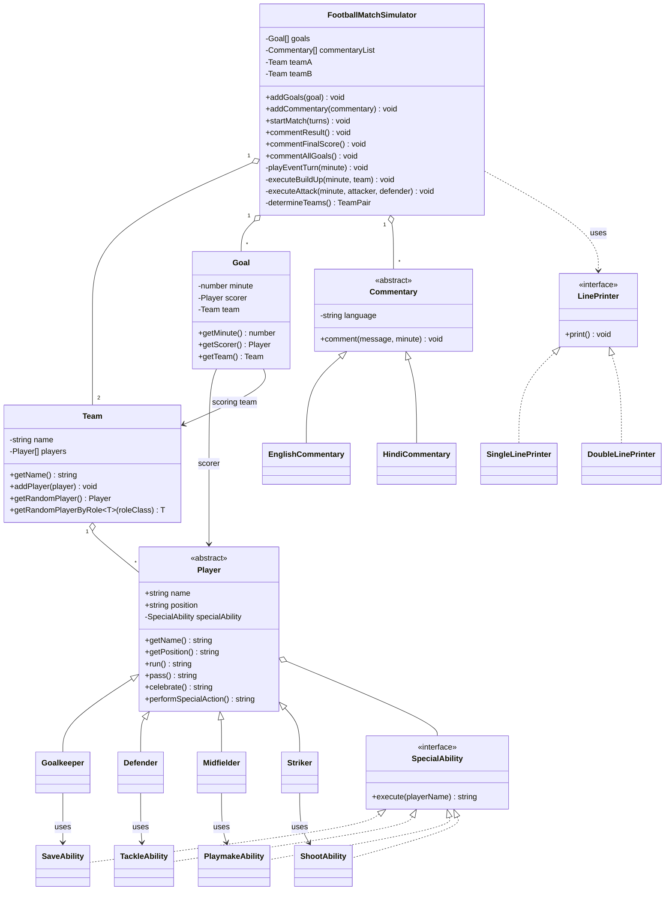
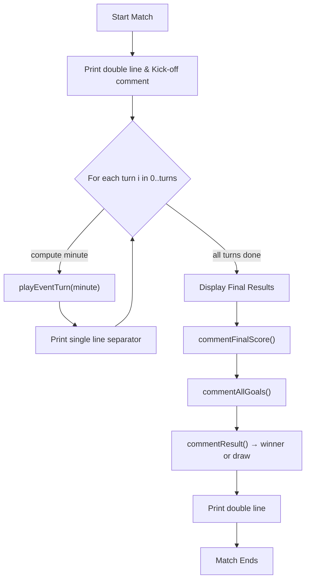
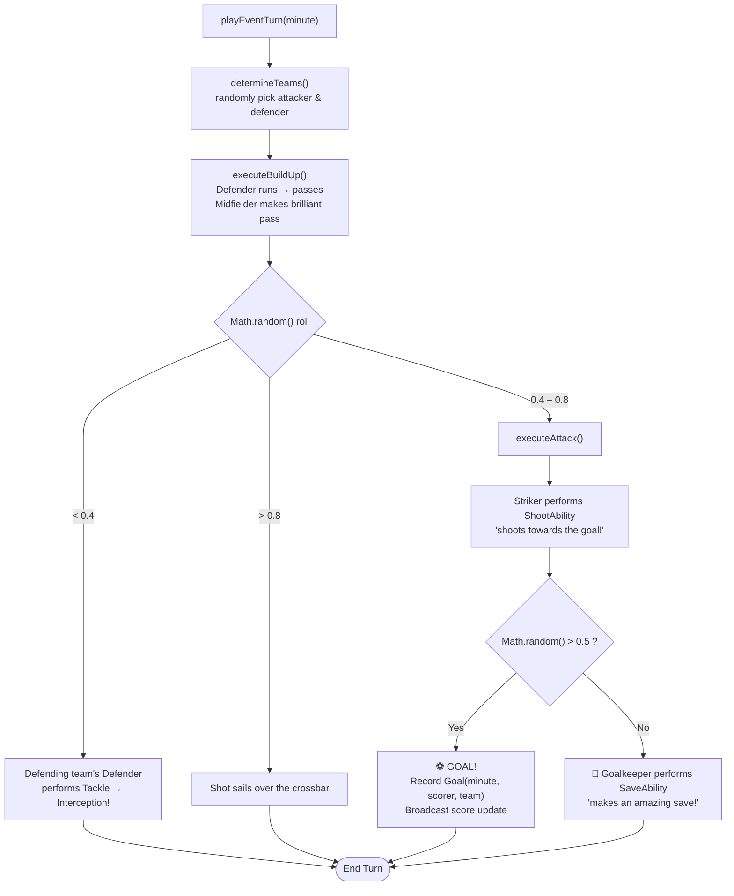
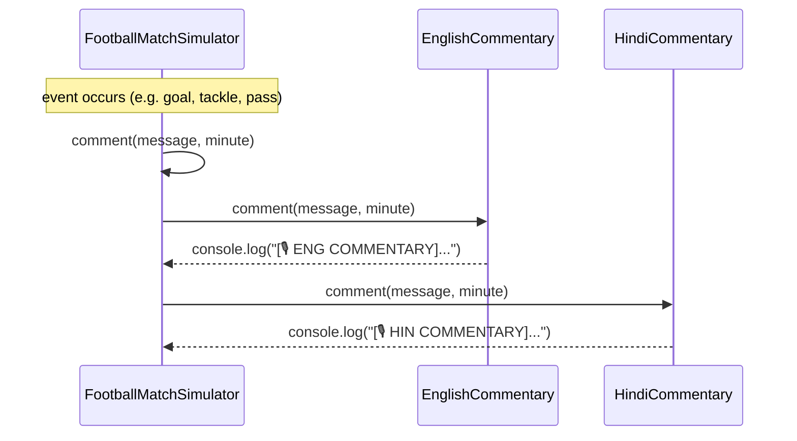

# ⚽ Football Match Simulator

A TypeScript console application that simulates a football (soccer) match between two teams, complete with live, minute-by-minute commentary. The project is built around clean OOP design principles — strategy pattern for player abilities, polymorphism for player roles, and a pluggable commentary/printer system.

---

## Table of Contents

- [Overview](#overview)
- [Features](#features)
- [Project Structure](#project-structure)
- [Architecture Diagrams](#architecture-diagrams)
  - [Class Diagram](#class-diagram)
  - [Match Simulation Flow](#match-simulation-flow)
  - [Single Turn Decision Logic](#single-turn-decision-logic)
  - [Commentary Broadcast (Observer-style)](#commentary-broadcast-observer-style)
- [Getting Started](#getting-started)
- [Usage Example](#usage-example)
- [Sample Output](#sample-output)
- [Design Patterns Used](#design-patterns-used)
- [Extending the Simulator](#extending-the-simulator)

---

## Overview

`FootballMatchSimulator` orchestrates a match between two `Team` instances. Each turn, it randomly picks an attacking and defending team, simulates a build-up, and resolves the possession into either an **interception**, a **shot on goal** (which may result in a **goal** or a **save**), or a **miss**. All events are broadcast to one or more `Commentary` implementations (currently English and Hindi) and separated visually using pluggable `LinePrinter` implementations.

## Features

- 🏟️ Turn-based match simulation with configurable number of turns
- 🎙️ Multi-language live commentary (English, Hindi — easily extendable)
- 🧩 Role-based players (Goalkeeper, Defender, Midfielder, Striker), each with a unique **Special Ability**
- ⚽ Goal tracking with scorer, minute, and team
- 📊 Automatic score line, full-time summary, goal scorers list, and winner announcement
- 🖨️ Pluggable line/section printers for formatting console output

## Project Structure

```
FootballMatchSimulator/
├── src/
│   ├── index.ts                        # Entry point — sets up teams & starts the match
│   ├── FootballMatchSimulator.ts       # Core match engine
│   ├── Team.ts                         # Team + player roster
│   ├── Goal.ts                         # Value object representing a scored goal
│   ├── players/
│   │   ├── Player.ts                   # Abstract base player
│   │   ├── Goalkeeper.ts
│   │   ├── Defender.ts
│   │   ├── Midfielder.ts
│   │   └── Stricker.ts                 # Striker
│   ├── abilities/
│   │   ├── SpecialAbility.ts           # Strategy interface
│   │   ├── SaveAbility.ts              # Goalkeeper
│   │   ├── TackleAbility.ts            # Defender
│   │   ├── PlaymakeAbility.ts          # Midfielder
│   │   └── ShootAbility.ts             # Striker
│   ├── commentary/
│   │   ├── Commentary.ts               # Abstract commentary broadcaster
│   │   ├── EnglishCommentary.ts
│   │   └── HindiCommentary.ts
│   └── lineprinters/
│       ├── LinePrinter.ts              # Strategy interface
│       ├── SingleLinePrinter.ts        # Separates turns
│       └── DoubleLinePrinter.ts        # Separates match sections
├── dist/                               # Compiled JS output (from tsc)
├── package.json
└── tsconfig.json
```

---

## Architecture Diagrams

### Class Diagram

Shows how the core domain objects relate to one another — a `FootballMatchSimulator` owns two `Team`s and drives events through `Commentary` and `LinePrinter` strategies, while each `Player` role delegates its special move to a `SpecialAbility` strategy.



### Match Simulation Flow

High-level flow from kickoff to full time, as executed by `startMatch()`.



### Single Turn Decision Logic

Each turn (`playEventTurn`) picks an attacking/defending team, plays a build-up sequence, then rolls a random outcome.



### Commentary Broadcast (Observer-style)

`FootballMatchSimulator` holds a list of `Commentary` implementations and fans out every event message to all of them simultaneously — so a single in-game event (e.g. a goal) is narrated in every registered language at once.



---

## Getting Started

### Prerequisites

- [Node.js](https://nodejs.org/) (with npm)
- TypeScript (installed as a dev dependency)

### Installation

```bash
git clone <this-repo-url>
cd FootballMatchSimulator
npm install
```

### Build & Run

```bash
npx tsc          # compile TypeScript → dist/
node dist/index.js
```

Or, using the provided npm script (compiles and runs in one step):

```bash
npm start
```

## Usage Example

```ts
import Striker from "./players/Stricker";
import Midfielder from "./players/Midfielder";
import Defender from "./players/Defender";
import Goalkeeper from "./players/Goalkeeper";
import EnglishCommentary from "./commentary/EnglishCommentary";
import HindiCommentary from "./commentary/HindiCommentary";
import Team from "./Team";
import FootballMatchSimulator from "./FootballMatchSimulator";

const argentina = new Team("Argentina");
argentina.addPlayer(new Goalkeeper("Emiliano Martínez"));
argentina.addPlayer(new Defender("Nahuel Molina"));
argentina.addPlayer(new Midfielder("Enzo Fernández"));
argentina.addPlayer(new Striker("Lionel Messi"));

const france = new Team("France");
france.addPlayer(new Goalkeeper("Mike Maignan"));
france.addPlayer(new Defender("Jules Koundé"));
france.addPlayer(new Midfielder("Aurélien Tchouaméni"));
france.addPlayer(new Striker("Kylian Mbappé"));

const match = new FootballMatchSimulator(argentina, france);
match.addCommentary(new EnglishCommentary("ENG"));
match.addCommentary(new HindiCommentary("HIN"));

match.startMatch(4); // simulate 4 turns
```

Each team needs at least one `Goalkeeper`, `Defender`, `Midfielder`, and `Striker`, since `Team.getRandomPlayerByRole()` picks randomly among players of the requested role for each event.

## Sample Output

```
==============================================================================================================================
[🎙️  ENG COMMENTARY]: [⌚ 0] 🏁 Kick-off! Match started between Argentina and France! 🏁
==============================================================================================================================
[🎙️  ENG COMMENTARY]: [⌚ 22] France building up play. Dayot Upamecano is running.
[🎙️  ENG COMMENTARY]: [⌚ 22] Dayot Upamecano makes a pass.
[🎙️  ENG COMMENTARY]: [⌚ 22] Aurélien Tchouaméni makes a brilliant long pass!
[🎙️  ENG COMMENTARY]: [⌚ 22] Interception! Nahuel Molina performs a strong tackle!
------------------------------------------------------------------------------------------------------------------------------
[🎙️  ENG COMMENTARY]: [⌚ 45] Argentina building up play. Nicolás Tagliafico is running.
[🎙️  ENG COMMENTARY]: [⌚ 45] Nicolás Tagliafico makes a pass.
[🎙️  ENG COMMENTARY]: [⌚ 45] Enzo Fernández makes a brilliant long pass!
[🎙️  ENG COMMENTARY]: [⌚ 45] Lionel Messi shoots towards the goal!
[🎙️  ENG COMMENTARY]: [⌚ 45] ⚽ GOAL!!! Argentina scores via Lionel Messi! Lionel Messi celebrates!
[🎙️  ENG COMMENTARY]: [⌚ 45] Live Score: Argentina 1 - 0 France
------------------------------------------------------------------------------------------------------------------------------
[🎙️  ENG COMMENTARY]: [⌚ 90] 🏁 Full Time! 🏁
[🎙️  ENG COMMENTARY]: [⌚ 90] Final Score: Argentina [1] vs [0] France
[🎙️  ENG COMMENTARY]: [⌚ 90] Lionel Messi (Argentina)
[🎙️  ENG COMMENTARY]: [⌚ 90] 🏆 Winner: Argentina!
==============================================================================================================================
```

## Design Patterns Used

| Pattern | Where | Why |
|---|---|---|
| **Strategy** | `SpecialAbility` (Save/Tackle/Playmake/Shoot) | Each player role executes a different action without `Player` needing to know the concrete behavior |
| **Strategy** | `LinePrinter` (Single/Double) | Swappable console formatting without changing the simulator |
| **Template/Abstract Class** | `Player`, `Commentary` | Shared behavior (`run`, `pass`, `celebrate` / `comment`) with room for subclass specialization |
| **Observer-ish Broadcast** | `commentaryList` in `FootballMatchSimulator` | One event fans out to every registered commentary language |
| **Factory-free Composition** | `Team.getRandomPlayerByRole<T>()` | Generic role lookup used to fetch the right player for build-up, tackles, shots, and saves |

## Extending the Simulator

- **Add a new language:** create `SpanishCommentary extends Commentary` and register it with `addCommentary()`.
- **Add a new player role:** extend `Player`, implement a new `SpecialAbility`, and add role-specific logic in `FootballMatchSimulator` where relevant.
- **Change match length/granularity:** pass a different `turns` value to `startMatch(turns)` — minutes are auto-distributed across 90 minutes.
- **Add extra time / penalties:** `Goal` already validates minutes up to 120, so extending `startMatch` to simulate extra time is a natural next step.